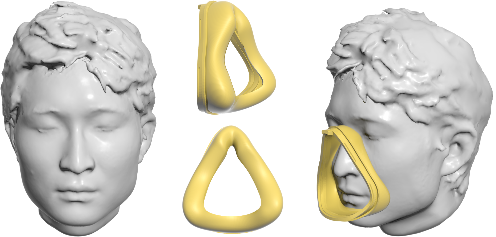

# Computational Design of Custom-Fit PAP Masks

 

This repository is the official implementation of the paper [Computational Design of Custom-Fit PAP Masks](https://sutd-cgl.github.io/supp/Publication/projects/2024-SMI-MaskDesign/index.html). 
The code customizes a generic mask cushion based on an input human face model that is aligned with the generic mask. The output is the customized cushion surface and mask interface.

## Repository structure

The repository contains the following items:

- **Files**
  - **CMakeLists.txt**: This is the main configuration file for CMake. It defines this project's build process, specifying which files to compile, the required dependencies, and other build instructions.
  - **README.md**: This file contains an introduction to this project, instructions on how to build and run it.
  - **parameters.txt**: This file contains the main parameters involved in this project.
  - **LICENSE**: This file contains the license under which the project's code is distributed. 

- **Folders**
  - **bin/Release**: This directory contains the compiled binaries of the project built in release mode. Release mode is optimized for performance and is usually stripped of debugging information.
  - **cmake**: This directory contains additional CMake modules or configuration files used by the `CMakeLists.txt` to manage the build process.
  - **lib**: This directory holds compiled libraries that the project depends on. 
  - **src**: This directory contains the source code of the project. It includes the `.cpp`, `.h`, `.c`, `.hpp`, and other source files written in the project in C++.

- **Data**

  - **data**: This directory is used to store the input data files required by this project. 
  - **output**: This directory contains the output data of the code.
  - **resources** This directory contains images used in the README file.
  
## Build (Windows only):
### Dependencies

- [OpenMesh](https://www.graphics.rwth-aachen.de/software/openmesh/), [Eigen](https://eigen.tuxfamily.org/index.php?title=Main_Page), [ALGLIB](https://www.alglib.net/), [CGAL](https://www.cgal.org/), [TriangleMeshDistance](https://github.com/InteractiveComputerGraphics/TriangleMeshDistance), [cppoptlib](https://github.com/PatWie/CppNumericalSolvers), [NelderMead](https://people.math.sc.edu/Burkardt/cpp_src/asa047/asa047.html) are already included in the project, and can be built through CMake.
- [libigl](https://libigl.github.io/), [finite-diff](https://github.com/zfergus/finite-diff), [Discregrid](https://github.com/InteractiveComputerGraphics/Discregrid?tab=readme-ov-file) are automatically downloaded and built through CMake.


### Configuration & Compilation

- First, ensure that Microsoft Visual Studio 2022 and CMake-GUI are installed. They can be downloaded here ([Microsoft Visual Studio 2022](https://visualstudio.microsoft.com/vs/), [CMake-GUI](https://github.com/Kitware/CMake/releases/download/v3.30.0-rc3/cmake-3.30.0-rc3.zip)).

- Then, make sure you are located in your home directory(`MaskDesign/`) and create a new `build` folder in your home directory, which you can also do with code:  `mkdir build`

- Next, complete the configuration of `Where is the source code`  and  `Where to build the binaries` in CMake-GUI:

  

- Click `Configure`, and just use the default options for all of the Configure settings; see inset below. On first use, the whole process takes about 5-10 minutes. Then click `Generate`.
<div align=center></div>

- Run the script `Run.bat` in the `MaskDesign` (home) folder.

  ```bat
  Run.bat
  ```

- Click `Open Project` on CMake-GUI. Then build the project in Visual Studio.

## Usage:
### Running the Program:
From home diretory, navigate to the release directory and execute the program with the path to the human face model file as an argument:
```bash
cd ./bin/Release
./MaskDesign.exe [path_to_human_face_file]
```
For instance, to reproduce a result from Fig.8 in the paper:
```bash
./MaskDesign.exe path_to_data_folder/human_face/face1.obj
```
See the input human face and it's alignment with the generic mask here:

<div align=center></div>

To use a different human face model, align it with the generic mask [generice mask](./data/generic_cushion/generic_mask_interface.obj) first. We assume that the alignment simulates the scenario of a human wearing the mask, and some interpenetration is expected.

### Program Output:
A **customized cushion surface** and a **customized mask interface** will be saved as triangle meshes to `./output` folder. Here is the output visualized in MeshLab:

<div align=center></div>

### Modifying Design Parameters:
You can modify design parameters in the [parameters.txt](parameters.txt) file. Comments starting with "#" describe the parameters. Key parameters are those related to cushion comfort, air leakage measurement, and trajectory curve initialization:
```bash
# cushion optimization parameters 
1e3 # evaluation comfort metric: average pressure 
0.2 # evaluation air leakage metric: force distribution
2e-4 # evaluation air leakage metric: area distribution

# (cushion initialization) trajectory curve adjustment weight:
1e3 # objective function: measuring curve to human face distance
2e-4 # cushion width
5e-6 # curvature; control curve smoothness
0.01 # symmetry
1e8 # alignment
120.0 # angle
```

## How to cite

If you want to use any part of this work, please use the following reference:

```
@article{Lu-2024-MaskDesign,
    author={Yukun Lu and Yuhang Wang and Peng Song and Hang Siang Wong and Yingjuan Mok 	and Ligang Liu},
    title={Computational Design of Custom-Fit PAP Masks },
    journal={Computers & Graphics (Proc. of Shape Modeling International)},
    year={2024} 
}
```